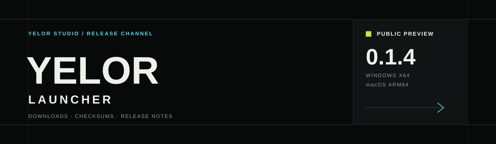

<div align="center">
  
</div>

<div align="center">
  <br>
  
  <br><br>
  <strong>Yelor Launcher 公共下载与发行信息</strong>
  <br><br>
  <a href="https://github.com/Z1urRr/Yelor-Launcher-Downloads/releases/tag/v0.1.4-public-preview"></a>
  <a href="https://github.com/Z1urRr/Yelor-Launcher-Downloads/releases"></a>
  
  
</div>

---

## 下载 Yelor Launcher

> 当前为 **0.1.4 Public Preview**。请从本仓库 Release 下载，避免使用未经 Yelor Studio 发布的转载包。

| 平台 | 推荐下载 | 适用设备 | 状态 |
|:--|:--|:--|:--|
| **Windows** | [下载 `Yelor-Launcher-0.1.4.exe`](https://github.com/Z1urRr/Yelor-Launcher-Downloads/releases/download/v0.1.4-public-preview/Yelor-Launcher-0.1.4.exe) | Windows 10 / 11，x64 | 公测候选，未签署 Authenticode |
| **macOS** | [下载 `Yelor-Launcher-0.1.4-macos-arm64.dmg`](https://github.com/Z1urRr/Yelor-Launcher-Downloads/releases/download/v0.1.4-public-preview/Yelor-Launcher-0.1.4-macos-arm64.dmg) | Apple Silicon，ARM64 | 公测候选，签名与公证状态待独立确认 |
| **macOS 备用包** | [下载 `.app.zip`](https://github.com/Z1urRr/Yelor-Launcher-Downloads/releases/download/v0.1.4-public-preview/Yelor-Launcher-0.1.4-macos-arm64.app.zip) | Apple Silicon，ARM64 | 手动解压使用 |

<details>
<summary><strong>高级用户：自动更新归档</strong></summary>

`.app.tar.gz` 是 Tauri 更新归档，不是首次安装的首选格式。当前发布没有配套公开 updater `.sig`，因此不要将它作为正式自动更新制品。

[下载 `Yelor-Launcher-0.1.4-macos-arm64.app.tar.gz`](https://github.com/Z1urRr/Yelor-Launcher-Downloads/releases/download/v0.1.4-public-preview/Yelor-Launcher-0.1.4-macos-arm64.app.tar.gz)

</details>

## 版本信息

| 项目 | 内容 |
|:--|:--|
| 版本 | `0.1.4` |
| 发布通道 | `Public Preview` |
| Windows 架构 | `x86_64` |
| macOS 架构 | `aarch64 / Apple Silicon` |
| 下载来源 | GitHub Releases |
| 校验算法 | SHA-256 |

### SHA-256

```text
69092AB7C3D198B076F4A411603E337487C7CAE189D1BE4CDDF7959C593E41C9  Yelor-Launcher-0.1.4.exe
2AC7E2ADC22F773E77DF22F7809F44C6C43D0CE15592D14FA0C50ABDFD6F7C55  Yelor-Launcher-0.1.4-macos-arm64.dmg
40CE1A71DCA6513F2062A2BB171D8C37CE8A209EEF83A56F89DBDB4D25C9F34C  Yelor-Launcher-0.1.4-macos-arm64.app.zip
C64FD77B5E4F6C1C400BA04974D1A04A53EC279F02E549A13D4E005C2EADF4B9  Yelor-Launcher-0.1.4-macos-arm64.app.tar.gz
```

完整清单见 [`SHA256SUMS.txt`](SHA256SUMS.txt)。

## 安装

### Windows

1. 下载 `Yelor-Launcher-0.1.4.exe`。
2. 将启动器放入一个拥有写入权限的独立文件夹。
3. 启动器会依次尝试便携目录、系统 Minecraft 目录和用户数据目录。
4. 第一次进入后检查游戏目录与 Java 自动匹配结果。

### macOS

1. Apple Silicon Mac 优先下载 `.dmg`。
2. 打开镜像后将 Yelor Launcher 拖入“应用程序”。
3. 当前公测包的 Apple 签名与公证状态尚未在本仓库完成独立验收；遇到系统安全提示时不要关闭系统安全保护，请等待后续正式签名版本。

## 这次更新

- Minecraft 客户端核心下载显示真实字节进度与下载速度。
- 下载任务初始测速阶段显示 `0 B/s`，不再长期停留在 `--`。
- 修复首次启动 `.minecraft` 目录创建与可写目录回退。
- Java 自动选择采用版本和 Loader 兼容范围，不再简单选择最高版本。
- 修复 Steve / Alex 默认皮肤、皮肤页面流畅度、主题色状态和 Java 长路径显示。
- 收藏图标只表示收藏，不再与当前启动实例混淆。

## 开放内容范围

本仓库公开的是玩家发行材料、校验清单、问题模板和通用校验工具。Launcher 核心实现、账号安全逻辑、签名基础设施、生产密钥与服务端部署代码不在此仓库公开。

| 内容 | 是否公开 |
|:--|:--:|
| Release 安装包与校验值 | 是 |
| 通用 SHA-256 校验工具 | 是，MIT |
| 安装说明与公开更新记录 | 是 |
| Launcher 核心源码 | 否 |
| Yelor Web 与生产部署代码 | 否 |
| 密钥、证书、账号与玩家数据 | 永不公开 |

详见 [`OPEN_SOURCE.md`](OPEN_SOURCE.md)。

## 获得帮助

- [提交 Launcher 问题](https://github.com/Z1urRr/Yelor-Launcher-Downloads/issues/new/choose)
- [查看所有版本](https://github.com/Z1urRr/Yelor-Launcher-Downloads/releases)
- [安全问题报告方式](SECURITY.md)

---

<div align="center">
  <sub>YELOR STUDIO · MINECRAFT LAUNCHER · 2020–2026</sub><br>
  <sub>本项目与 Mojang Studios、Microsoft 或 Apple Inc. 无隶属关系。</sub>
</div>
